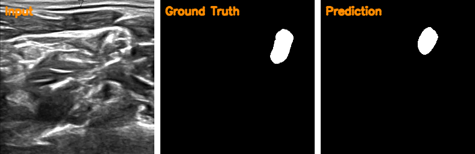

# Ultrasound Nerve Segmentation

A U-Net built from scratch in PyTorch to automatically segment nerve structures in ultrasound images — trained end-to-end with a combined BCE + Dice loss and evaluated with the Dice coefficient.

<p align="center">
  
</p>
<p align="center"><sub>Input ultrasound scan &nbsp;•&nbsp; ground-truth mask &nbsp;•&nbsp; model prediction</sub></p>


## Overview

Identifying nerve structures in ultrasound imagery is a key step in guiding indwelling catheter placement for pain management — a task that is normally slow and dependent on an expert's eye. This project tackles it as a binary semantic segmentation problem, using the [Kaggle Ultrasound Nerve Segmentation](https://www.kaggle.com/competitions/ultrasound-nerve-segmentation/data) dataset.

The model is a classic encoder–decoder **U-Net** implemented from scratch (no pretrained backbone), with skip connections between the encoder and decoder paths to preserve fine-grained spatial detail — important for tracing thin, irregular nerve boundaries.

## Highlights

- **U-Net from scratch** — 4-level encoder/decoder with skip connections, implemented directly in PyTorch (`src/model.py`) rather than imported from a library.
- **Combined BCE + Dice loss** for stable convergence on a task with significant class imbalance (nerve regions are a small fraction of each image).
- **Albumentations-based augmentation pipeline** (flips, affine transforms, brightness/contrast jitter, Gaussian noise) to improve generalization on a modestly sized medical imaging dataset.
- **Full training/inference pipeline** — checkpointing of the best model by Dice score, LR scheduling via `ReduceLROnPlateau`, and a standalone prediction script with morphological post-processing.
- **Visualization utilities** to compare input, ground truth, and predicted masks side by side.

## Architecture

```
Input (1×256×256)
   │
   ├── Encoder: 4× [Conv-BN-ReLU ×2 → MaxPool]   (64 → 128 → 256 → 512 channels)
   │
   ├── Bottleneck: Conv-BN-ReLU ×2                (1024 channels)
   │
   └── Decoder: 4× [ConvTranspose2d → concat skip → Conv-BN-ReLU ×2]
                                                    (512 → 256 → 128 → 64 channels)
   │
Output: 1×256×256 segmentation logits
```

Each decoder stage upsamples via a transposed convolution and concatenates the corresponding encoder feature map (the skip connection), so spatial detail lost during downsampling is recovered during reconstruction.

## Project Structure

```
ultrasound-nerve-segmentation/
├── src/
│   ├── model.py         # U-Net architecture
│   ├── data_loader.py   # Dataset, augmentations, and DataLoader builder
│   ├── train.py         # Training loop, loss, metrics, checkpointing
│   ├── predict.py       # Batch inference on a test folder
│   └── visualise.py     # Side-by-side visualization of a single prediction
├── examples/             # Sample inputs, ground-truth masks, and predictions
├── requirements.txt
└── README.md
```

## Getting Started

### 1. Clone and install dependencies

```bash
git clone https://github.com/RoshiniEvangelin/ultrasound-nerve-segmentation.git
cd ultrasound-nerve-segmentation

conda create -n nerve_seg python=3.10
conda activate nerve_seg
pip install -r requirements.txt
```

### 2. Get the dataset

Download the [Ultrasound Nerve Segmentation dataset](https://www.kaggle.com/competitions/ultrasound-nerve-segmentation/data) from Kaggle (manually, or via the Kaggle API) and arrange it as:

```
dataset/
└── train/
    ├── images/
    │   ├── 1_1.tif
    │   └── ...
    └── masks/
        ├── 1_1_mask.tif
        └── ...
```

> **Note:** the current scripts point at local Windows paths (`C:\Users\RE\Desktop\nerve\...`) at the top of `train.py` and `predict.py`. Update `TRAIN_IMG_DIR`, `TRAIN_MASK_DIR`, and `MODEL_SAVE_PATH` (and the equivalents in `predict.py`) to match your own dataset location before running.

### 3. Train

```bash
python -m src.train
```

The training loop tracks loss and Dice score every epoch, checkpoints the best-performing weights to disk, and plots training curves on completion.

### 4. Run inference

```bash
python -m src.predict
```

This loads the best checkpoint, runs it over every image in the configured test folder, applies morphological open/close cleanup to the predicted masks, and saves the results — plus a quick visual preview of the first few predictions.

## Model Configuration

| Component | Setting |
|---|---|
| Architecture | U-Net (4 encoder/decoder levels, skip connections) |
| Loss | 0.5 × BCEWithLogitsLoss + 0.5 × Dice loss |
| Optimizer | Adam (lr = 1e-5) |
| Scheduler | ReduceLROnPlateau (patience = 3, factor = 0.5) |
| Metric | Dice coefficient |
| Input size | 256 × 256, single-channel (grayscale) |
| Epochs | 40 |
| Batch size | 8 |

## Tech Stack

Python · PyTorch · OpenCV · Albumentations · NumPy · Matplotlib · tqdm

## Roadmap

- [ ] Add a held-out validation split and report quantitative Dice/IoU results
- [ ] Parameterize dataset/checkpoint paths via CLI args or a config file instead of hard-coded paths
- [ ] Package a `.gitignore` for cached/compiled artifacts (`__pycache__`, checkpoints)
- [ ] Experiment with a pretrained encoder (e.g., ResNet) for transfer learning

## Author

**Roshini Evangelin Tamanamu** — ML Engineer, M.S. Computer Science @ Purdue University Northwest
[GitHub](https://github.com/RoshiniEvangelin)
